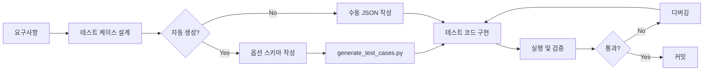

# Unit Test Addition Manual
# 유닛 테스트 추가 실무 가이드

## 목차
1. [빠른 시작 가이드](#빠른-시작-가이드)
2. [테스트 타입별 추가 방법](#테스트-타입별-추가-방법)
3. [실제 예제: Buffer Size 0 테스트](#실제-예제-buffer-size-0-테스트)
4. [체크리스트](#체크리스트)
5. [자주 하는 실수와 해결법](#자주-하는-실수와-해결법)

---

## 빠른 시작 가이드

### 1분 만에 새 테스트 추가하기

```bash
# Step 1: 간단한 테스트 JSON 생성
cat > quick_test.json << EOF
{
  "metadata": {
    "version": "1.0.0",
    "date": "2025-01-02",
    "total_tests": 1
  },
  "test_cases": [
    {
      "id": "999",
      "category": "Quick Test",
      "test_type": "My New Test",
      "input": {
        "type": "SimpleTest",
        "values": {
          "param1": "value1"
        }
      },
      "expected_result": "Success",
      "timeout_ms": 1000,
      "enabled": true
    }
  ]
}
EOF

# Step 2: 테스트 실행
./pers_json_tests.exe 1000 quick_test.json
```

---

## 테스트 타입별 추가 방법

### Type 1: 단순 Pass/Fail 테스트

**사용 시기**: 단순히 함수가 성공/실패하는지 확인

```json
{
  "id": "100",
  "category": "Basic Tests",
  "test_type": "Simple Function Test",
  "input": {
    "type": "SimpleTest",
    "values": {}
  },
  "expected_result": "Success",
  "timeout_ms": 100
}
```

**코드 추가 위치**: `json_test_loader_rapidjson.cpp`
```cpp
else if (testCase.testType == "Simple Function Test") {
    bool result = mySimpleFunction();
    if (result) {
        actualResult = "Success";
        return true;
    } else {
        actualResult = "Failed";
        failureReason = "Function returned false";
        return false;
    }
}
```

### Type 2: 파라미터 테스트

**사용 시기**: 다양한 입력값으로 테스트

```json
{
  "id": "200",
  "category": "Parameter Tests",
  "test_type": "Parameter Test",
  "input": {
    "type": "ParameterTest",
    "values": {
      "size": "1024",
      "name": "TestBuffer",
      "enabled": "true"
    }
  },
  "expected_result": "Valid buffer",
  "timeout_ms": 500
}
```

**코드 추가**:
```cpp
else if (testCase.testType == "Parameter Test") {
    // 파라미터 파싱
    int size = 0;
    if (testCase.inputValues.find("size") != testCase.inputValues.end()) {
        size = std::stoi(testCase.inputValues.at("size"));
    }
    
    std::string name = "default";
    if (testCase.inputValues.find("name") != testCase.inputValues.end()) {
        name = testCase.inputValues.at("name");
    }
    
    // 테스트 실행
    auto result = createBufferWithParams(size, name);
    
    // 결과 확인
    if (result != nullptr) {
        actualResult = "Valid buffer";
        return testCase.expectedResult == actualResult;
    } else {
        actualResult = "Null buffer";
        failureReason = "Buffer creation failed";
        return false;
    }
}
```

### Type 3: 옵션 기반 자동 생성 테스트

**사용 시기**: 많은 조합을 자동으로 테스트하고 싶을 때

#### Step 1: 옵션 스키마 정의
`test_option_schema.json` 수정:
```json
{
  "test_categories": {
    "my_feature": {
      "base_type": "My Feature Test",
      "option_dimensions": {
        "mode": {
          "type": "enum",
          "values": ["Fast", "Accurate", "Balanced"],
          "description": "Processing mode"
        },
        "threads": {
          "type": "integer",
          "values": [1, 2, 4, 8],
          "description": "Number of threads"
        },
        "cache_enabled": {
          "type": "boolean",
          "values": [true, false],
          "description": "Enable caching"
        }
      }
    }
  }
}
```

#### Step 2: 생성 전략 설정
`generate_test_cases.py` 수정:
```python
category_strategies = {
    "my_feature": "boundary",  # 경계값 테스트
    # 또는 "exhaustive" - 모든 조합
    # 또는 "critical_path" - 주요 경로만
    # 또는 "pairwise" - 쌍별 조합
}
```

#### Step 3: 테스트 생성
```bash
python generate_test_cases.py
```

#### Step 4: 실행 코드 추가
```cpp
else if (baseType == "My Feature Test") {
    // 옵션 파싱
    const auto& options = testCase.inputValues;
    
    std::string mode = "Fast";
    if (options.find("mode") != options.end()) {
        mode = options.at("mode");
    }
    
    int threads = 1;
    if (options.find("threads") != options.end()) {
        threads = std::stoi(options.at("threads"));
    }
    
    bool cacheEnabled = false;
    if (options.find("cache_enabled") != options.end()) {
        cacheEnabled = (options.at("cache_enabled") == "true");
    }
    
    // 테스트 실행
    auto result = myFeatureTest(mode, threads, cacheEnabled);
    
    if (result.success) {
        actualResult = "Success with options";
        return true;
    } else {
        actualResult = result.error;
        failureReason = "Test failed with options";
        return false;
    }
}
```

---

## 실제 예제: Buffer Size 0 테스트

### 문제 상황
- 버퍼 크기 0으로 생성 시 어떻게 동작해야 하는가?
- 현재: 객체는 생성되지만 내부 버퍼는 null
- 기대: nullptr 반환

### Step 1: 현재 동작 확인

```json
{
  "id": "BUF001",
  "category": "Buffer Edge Cases",
  "test_type": "Buffer Creation 0 Size",
  "input": {
    "type": "BufferTest",
    "values": {
      "size": "0",
      "usage": "Vertex"
    }
  },
  "expected_result": "Returns nullptr",
  "timeout_ms": 100
}
```

### Step 2: 테스트 코드 작성

```cpp
else if (testCase.testType == "Buffer Creation 0 Size") {
    auto factory = std::make_shared<WebGPUBackendFactory>();
    auto instance = factory->createInstance({});
    auto physicalDevice = instance->requestPhysicalDevice({});
    auto device = physicalDevice->createLogicalDevice({});
    auto resourceFactory = device->getResourceFactory();
    
    BufferDesc desc;
    desc.size = 0;
    desc.usage = BufferUsage::Vertex;
    
    auto buffer = resourceFactory->createBuffer(desc);
    
    if (!buffer) {
        actualResult = "Returns nullptr";
        return testCase.expectedResult == actualResult;
    } else {
        // 버퍼가 생성되었지만 유효한지 확인
        if (!buffer->isValid()) {  // isValid() 메서드가 있다면
            actualResult = "Invalid buffer created";
            failureReason = "Buffer created but invalid";
            return false;
        } else {
            actualResult = "Valid buffer with size 0";
            failureReason = "Should return nullptr for size 0";
            return false;
        }
    }
}
```

### Step 3: 구현 수정 (필요한 경우)

`WebGPUResourceFactory.cpp`:
```cpp
std::shared_ptr<IBuffer> WebGPUResourceFactory::createBuffer(const BufferDesc& desc) {
    if (!_device) {
        LOG_ERROR("WebGPUResourceFactory",
            "Cannot create buffer without device");
        return nullptr;
    }
    
    // Size 0 체크 추가
    if (desc.size == 0) {
        LOG_WARNING("WebGPUResourceFactory",
            "Cannot create buffer with size 0");
        return nullptr;  // nullptr 반환
    }
    
    return std::make_shared<WebGPUBuffer>(desc, _device);
}
```

---

## 체크리스트

### ✅ 새 테스트 추가 체크리스트

- [ ] **테스트 ID는 유니크한가?**
  - 기존 테스트와 중복되지 않는 ID 사용
  - 카테고리별 prefix 권장 (BUF_, TEX_, etc.)

- [ ] **카테고리가 적절한가?**
  - 기존 카테고리 재사용 우선
  - 새 카테고리는 명확한 이름으로

- [ ] **타임아웃이 적절한가?**
  - 단순 테스트: 100-500ms
  - 복잡한 테스트: 1000-5000ms
  - 성능 테스트: 10000ms+

- [ ] **기대 결과가 명확한가?**
  - "Success", "Returns nullptr", "Valid instance" 등
  - 모호한 표현 피하기

- [ ] **에러 메시지가 도움이 되는가?**
  - "Failed" X
  - "Buffer creation failed: size must be > 0" O

- [ ] **리소스 정리가 되는가?**
  - 생성한 모든 리소스 해제
  - shared_ptr 사용으로 자동 정리

---

## 자주 하는 실수와 해결법

### 실수 1: 테스트가 실행되지 않음

**증상**: 테스트가 "Not implemented" 로 실패

**원인**: test_type 문자열이 정확히 일치하지 않음

**해결**:
```cpp
// 잘못된 예
if (testCase.testType == "Buffer Test")  // JSON에는 "Buffer Creation Test"

// 올바른 예
if (testCase.testType == "Buffer Creation Test")  // 정확히 일치
```

### 실수 2: 파라미터 파싱 실패

**증상**: 파라미터가 항상 기본값

**원인**: inputValues 키 이름 불일치

**해결**:
```cpp
// JSON
"values": {
  "buffer_size": "1024"  // 언더스코어 사용
}

// 코드
if (testCase.inputValues.find("buffer_size") != testCase.inputValues.end()) {
    // buffer-size 나 bufferSize 가 아님!
}
```

### 실수 3: 타임아웃 발생

**증상**: 테스트가 Timeout으로 실패

**원인**: 
1. 무한 루프
2. 동기화 대기
3. 너무 짧은 타임아웃

**해결**:
```json
{
  "timeout_ms": 5000  // 충분한 시간 제공
}
```

### 실수 4: 메모리 누수

**증상**: 테스트 후 메모리 사용량 증가

**원인**: raw pointer 사용, 순환 참조

**해결**:
```cpp
// 잘못된 예
WebGPUBuffer* buffer = new WebGPUBuffer(...);
// delete 없음!

// 올바른 예  
auto buffer = std::make_shared<WebGPUBuffer>(...);
// 자동 해제
```

### 실수 5: 스레드 안전성

**증상**: 간헐적 실패, 크래시

**원인**: Logger 콜백이 스레드별로 설정되지 않음

**해결**: 테스트 스레드 내에서 콜백 설정
```cpp
std::thread testThread([&]() {
    // 스레드 내에서 콜백 설정
    pers::Logger::Instance().setCallback(...);
    // 테스트 실행
});
```

---

## 디버깅 팁

### 1. 단일 테스트 실행

```bash
# 특정 테스트만 포함한 JSON 생성
echo '{"metadata":{"version":"1.0.0"},"test_cases":[<your_test>]}' > single.json
./pers_json_tests.exe 10000 single.json
```

### 2. 상세 로그 활성화

```cpp
// json_test_main.cpp에 추가
pers::Logger::Instance().setLevel(pers::LogLevel::Debug);
```

### 3. 중단점 설정

```cpp
else if (testCase.testType == "My Test") {
    // 여기에 중단점
    int breakpoint_here = 1;
    
    // 테스트 코드...
}
```

### 4. 결과 분석

```bash
# 실패한 테스트만 보기
grep "FAIL" test_results.json -B2 -A5

# 특정 카테고리만 보기
grep "Buffer" test_results.json -A10
```

---

## 템플릿

### 최소 테스트 JSON 템플릿

```json
{
  "metadata": {
    "version": "1.0.0",
    "date": "2025-01-02",
    "total_tests": 1
  },
  "test_cases": [
    {
      "id": "XXX001",
      "category": "Category Name",
      "test_type": "Test Type Name",
      "input": {
        "type": "TestType",
        "values": {}
      },
      "expected_result": "Expected Result",
      "timeout_ms": 1000,
      "enabled": true
    }
  ]
}
```

### 테스트 코드 템플릿

```cpp
else if (testCase.testType == "Test Type Name") {
    // 1. 셋업
    auto factory = std::make_shared<WebGPUBackendFactory>();
    auto instance = factory->createInstance({});
    // ... 필요한 리소스 생성
    
    // 2. 파라미터 파싱
    // testCase.inputValues에서 필요한 값 추출
    
    // 3. 테스트 실행
    // 실제 테스트 로직
    
    // 4. 결과 검증
    if (/* 성공 조건 */) {
        actualResult = "성공 메시지";
        return testCase.expectedResult == actualResult;
    } else {
        actualResult = "실패 상태";
        failureReason = "실패 이유 설명";
        return false;
    }
}
```

---

## 통합 테스트 워크플로우



---

*이 문서는 실무에서 바로 사용할 수 있는 가이드입니다.*
*질문이나 개선 사항은 GitHub Issues에 등록해주세요.*