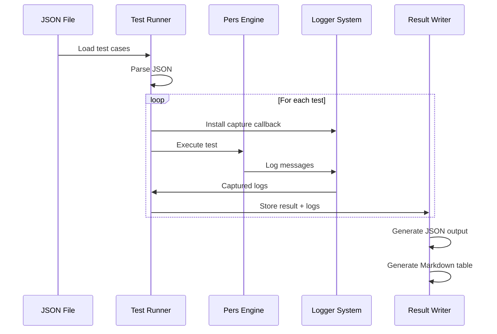
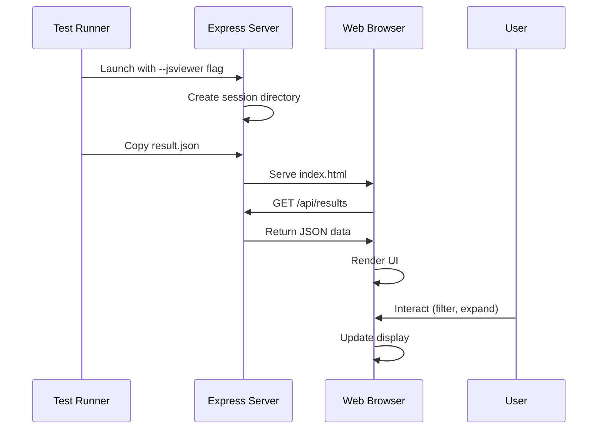

# System Architecture

## Overview

The Pers unit test framework consists of three main components working together to provide comprehensive testing capabilities:

```
┌─────────────────────────────────────────────────────────────────┐
│                     JSON Test Definition                         │
│                  (test_cases_2025_01_02.json)                   │
└────────────────────────┬────────────────────────────────────────┘
                         │
                         ▼
┌─────────────────────────────────────────────────────────────────┐
│                    C++ Test Runner                               │
│  ┌──────────────┐  ┌──────────────┐  ┌──────────────────────┐ │
│  │ JSON Parser  │→ │ Test Executor │→ │ Result Writer        │ │
│  └──────────────┘  └──────────────┘  └──────────────────────┘ │
│         │                  │                     │              │
│         │                  ▼                     ▼              │
│         │          ┌──────────────┐    ┌──────────────┐        │
│         │          │ Log Capture  │    │ JSON Output  │        │
│         │          └──────────────┘    └──────────────┘        │
└─────────────────────────────────────────────────────────────────┘
                         │
                         ▼
┌─────────────────────────────────────────────────────────────────┐
│                    Web Result Viewer                             │
│  ┌──────────────┐  ┌──────────────┐  ┌──────────────────────┐ │
│  │ Express      │  │ Session      │  │ Frontend             │ │
│  │ Server       │  │ Management   │  │ (HTML/JS/CSS)        │ │
│  └──────────────┘  └──────────────┘  └──────────────────────┘ │
└─────────────────────────────────────────────────────────────────┘
```

## Component Hierarchy

### 1. Test Runner (C++)

```
pers_json_tests (executable)
├── main.cpp                       # Entry point
├── test_runner.h/cpp              # Core test execution
├── test_result_writer.h/cpp       # Result serialization
└── Dependencies
    ├── pers_static                # Pers engine library
    ├── wgpu_native                # WebGPU runtime
    └── nlohmann_json              # JSON parsing
```

### 2. Web Viewer (Node.js)

```
web/
├── server.js                      # Express server
├── public/
│   ├── index.html                # Main UI
│   ├── styles.css                # Styling
│   └── app.js                    # Frontend logic
└── sessions/                     # Session data storage
    └── [sessionId]/
        └── data/
            └── result.json       # Test results
```

## Data Flow

### 1. Test Execution Flow



### 2. Web Viewer Flow



## Dependencies

### Build Dependencies

- **CMake**: Build system
- **C++17 Compiler**: MSVC, GCC, or Clang
- **vcpkg**: Package management
  - nlohmann-json: JSON parsing
  - glfw3: Window management (for engine)
  - SDL3: Alternative window system

### Runtime Dependencies

- **wgpu_native.dll**: WebGPU implementation
- **Node.js**: For web viewer
- **Express**: Web server framework
- **Modern web browser**: Chrome, Firefox, Edge

### Engine Dependencies

```
Pers Engine
├── IInstance          # Graphics instance interface
├── IPhysicalDevice    # Physical device interface  
├── ILogicalDevice     # Logical device interface
├── IQueue             # Command queue interface
├── IResourceFactory   # Resource creation interface
└── Logger             # Logging system
```

## Thread Safety

### Log Capture Mechanism

The log capture system is designed to be thread-safe:

```cpp
class LogCapture {
    std::mutex _mutex;
    std::vector<std::string> _messages;
    std::atomic<bool> _capturing{false};
    
public:
    void startCapture() {
        _capturing = true;
        Logger::getInstance().addCallback(...);
    }
    
    void onLog(const LogInfo& info) {
        if (!_capturing) return;
        std::lock_guard<std::mutex> lock(_mutex);
        _messages.push_back(formatLog(info));
    }
};
```

### Test Execution

Each test runs in isolation with its own log capture:

1. Create new log capture instance
2. Install callback in logger
3. Execute test
4. Remove callback
5. Store captured logs with result

## Session Management

### Session Structure

```
web/sessions/
└── 1756846721596/              # Unix timestamp
    └── data/
        └── result.json          # Test results
```

### Session Lifecycle

1. **Creation**: New session created when test runner launches
2. **Storage**: Results copied to session directory
3. **Access**: Server serves from session directory
4. **Cleanup**: Manual or automated cleanup of old sessions

## Error Handling

### Test Execution Errors

```cpp
try {
    // Execute test
    auto result = executeTest(testCase);
} catch (const TodoOrDie::Exception& e) {
    // Capture as "Not Yet Implemented"
    result.status = TestStatus::NotYetImplemented;
} catch (const std::exception& e) {
    // Capture as failure
    result.status = TestStatus::Failed;
    result.failureReason = e.what();
}
```

### Web Server Errors

```javascript
app.use((err, req, res, next) => {
    console.error('Server error:', err.stack);
    res.status(500).json({ 
        error: 'Internal server error',
        message: err.message 
    });
});
```

## Getting Started

### Building the Test Runner

```bash
# Configure with CMake
cmake -B build -S . -DBUILD_TESTS=ON

# Build
cmake --build build --target pers_json_tests

# Run tests
./build/bin/Debug/pers_json_tests.exe test_cases.json
```

### Launching Web Viewer

```bash
# Run with web viewer flag
./pers_json_tests.exe --jsviewer test_cases.json

# Server automatically launches on http://localhost:5000
```

### Loading Local JSON Files

The web viewer supports loading local JSON files without running tests:

1. Click "Load JSON" button
2. Select a result.json file
3. View results immediately

## Performance Considerations

### Log Capture Overhead

- Minimal overhead: ~1-2ms per test
- Thread-local storage for capture state
- Efficient string formatting

### Web Viewer Performance

- Lazy loading of log details
- Virtual scrolling for large result sets
- Debounced filtering and search
- Cached DOM queries

## Security Considerations

### Path Traversal Protection

```javascript
// Sanitize session ID
const sanitizedSessionId = sessionId.replace(/[^0-9]/g, '');
const sessionPath = path.join(__dirname, 'sessions', sanitizedSessionId);
```

### XSS Prevention

```javascript
function escapeHtml(str) {
    const div = document.createElement('div');
    div.textContent = str;
    return div.innerHTML;
}
```

### CORS Configuration

```javascript
app.use(cors({
    origin: 'http://localhost:5000',
    credentials: true
}));
```