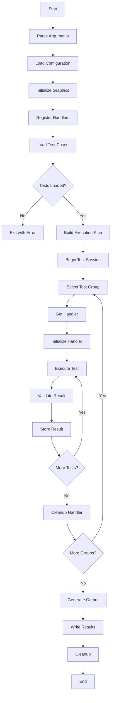

# Unit Test Program Operation Sequence

## Overview
This document describes the complete operation sequence of the Pers Graphics Engine unit test program, from startup to result generation.

## Program Architecture

```
┌─────────────────┐
│   Test Runner   │
├─────────────────┤
│ Handler Registry│
├─────────────────┤
│  Test Executor  │
├─────────────────┤
│ Result Processor│
├─────────────────┤
│ Output Generator│
└─────────────────┘
```

## Operation Sequence

### 1. Initialization Phase

```cpp
int main(int argc, char* argv[]) {
    // Step 1.1: Parse command line arguments
    CommandLineArgs args = parseCommandLine(argc, argv);
    
    // Step 1.2: Initialize logging system
    initializeLogging(args.logLevel, args.logFile);
    
    // Step 1.3: Load configuration
    TestConfig config = loadConfiguration(args.configFile);
    
    // Step 1.4: Initialize graphics system
    if (!initializeGraphicsSystem(config)) {
        LOG_ERROR("Failed to initialize graphics system");
        return -1;
    }
    
    // Step 1.5: Register all test handlers
    registerAllHandlers();
    
    // Step 1.6: Create test runner
    auto runner = std::make_unique<TestRunner>(config);
}
```

### 2. Test Loading Phase

```cpp
// Step 2.1: Discover test case files
std::vector<fs::path> testFiles = discoverTestFiles(args.testDirectory);

// Step 2.2: Load and parse each test file
for (const auto& file : testFiles) {
    try {
        // Parse JSON file
        json testData = json::parse(std::ifstream(file));
        
        // Validate file structure
        if (!validateTestFile(testData)) {
            LOG_WARNING("Invalid test file: " + file.string());
            continue;
        }
        
        // Register test cases
        runner->loadTestCases(testData);
        
    } catch (const std::exception& e) {
        LOG_ERROR("Failed to load test file: " + file.string());
    }
}

// Step 2.3: Build test execution plan
ExecutionPlan plan = runner->buildExecutionPlan();
LOG_INFO("Loaded " + std::to_string(plan.totalTests) + " tests");
```

### 3. Test Execution Phase

```cpp
// Step 3.1: Initialize result collector
ResultCollector collector;
collector.beginSession();

// Step 3.2: Execute tests based on plan
for (const auto& testGroup : plan.testGroups) {
    // Get handler for this test type
    auto handler = HandlerRegistry::createHandler(testGroup.handlerClass);
    
    if (!handler) {
        LOG_ERROR("Handler not found: " + testGroup.handlerClass);
        continue;
    }
    
    // Initialize handler
    if (!handler->initialize(config)) {
        LOG_ERROR("Failed to initialize handler: " + testGroup.handlerClass);
        continue;
    }
    
    // Run each test variation
    for (const auto& test : testGroup.tests) {
        TestResult result = executeTest(handler.get(), test);
        collector.addResult(test.id, result);
    }
    
    // Cleanup handler
    handler->cleanup();
}

// Step 3.3: Finalize results
collector.endSession();
```

### 4. Individual Test Execution

```cpp
TestResult executeTest(ITestHandler* handler, const TestCase& test) {
    TestResult result;
    
    // Step 4.1: Setup test environment
    TestEnvironment env;
    env.setup(test.id);
    
    // Step 4.2: Start monitoring
    auto monitor = std::make_unique<PerformanceMonitor>();
    monitor->beginMonitoring();
    
    // Step 4.3: Execute with timeout
    std::future<TestResult> future = std::async(std::launch::async, [&]() {
        try {
            return handler->execute(test.options);
        } catch (const std::exception& e) {
            TestResult errorResult;
            errorResult.success = false;
            errorResult.errorMessage = e.what();
            return errorResult;
        }
    });
    
    // Step 4.4: Wait with timeout
    auto status = future.wait_for(std::chrono::milliseconds(config.timeoutMs));
    
    if (status == std::future_status::ready) {
        result = future.get();
    } else {
        result.success = false;
        result.errorMessage = "Test timeout exceeded";
        result.errorCode = ERROR_TIMEOUT;
    }
    
    // Step 4.5: Collect performance metrics
    auto metrics = monitor->endMonitoring();
    result.executionTimeMs = metrics.cpuTimeMs;
    result.memoryUsedBytes = metrics.memoryUsedBytes;
    
    // Step 4.6: Validate result
    bool valid = validateResult(result, test.expectedBehavior);
    result.success = result.success && valid;
    
    // Step 4.7: Cleanup environment
    env.teardown();
    
    // Step 4.8: Log result
    logTestResult(test, result);
    
    return result;
}
```

### 5. Result Validation Phase

```cpp
bool validateResult(const TestResult& result, const json& expected) {
    // Step 5.1: Check return value
    if (expected.contains("returnValue")) {
        std::string expectedReturn = expected["returnValue"];
        if (!compareReturnValue(result.returnValue, expectedReturn)) {
            LOG_DEBUG("Return value mismatch: expected=" + expectedReturn + 
                     ", actual=" + result.returnValue);
            return false;
        }
    }
    
    // Step 5.2: Check properties
    if (expected.contains("properties")) {
        for (auto& [key, value] : expected["properties"].items()) {
            if (!validateProperty(result.properties, key, value)) {
                LOG_DEBUG("Property mismatch: " + key);
                return false;
            }
        }
    }
    
    // Step 5.3: Check error conditions
    if (expected.contains("shouldFail")) {
        bool shouldFail = expected["shouldFail"];
        if (shouldFail != !result.success) {
            LOG_DEBUG("Success state mismatch");
            return false;
        }
    }
    
    return true;
}
```

### 6. Output Generation Phase

```cpp
// Step 6.1: Generate JSON output
void generateJsonOutput(const ResultCollector& collector) {
    json output;
    
    // Session information
    output["session"] = {
        {"id", generateSessionId()},
        {"timestamp", getCurrentTimestamp()},
        {"duration_ms", collector.getSessionDuration()},
        {"platform", getPlatformInfo()},
        {"gpu_info", getGPUInfo()}
    };
    
    // Summary statistics
    output["summary"] = {
        {"total_tests", collector.getTotalTests()},
        {"passed", collector.getPassedCount()},
        {"failed", collector.getFailedCount()},
        {"skipped", collector.getSkippedCount()},
        {"total_time_ms", collector.getTotalExecutionTime()}
    };
    
    // Individual test results
    output["results"] = json::array();
    for (const auto& [testId, result] : collector.getResults()) {
        json testJson = {
            {"id", testId},
            {"status", result.success ? "passed" : "failed"},
            {"execution_time_ms", result.executionTimeMs},
            {"return_value", result.returnValue}
        };
        
        // Add properties if present
        if (!result.properties.empty()) {
            testJson["properties"] = propertiesToJson(result.properties);
        }
        
        // Add error info if failed
        if (!result.success) {
            testJson["error"] = {
                {"message", result.errorMessage},
                {"code", result.errorCode}
            };
        }
        
        // Add performance metrics
        if (!result.performanceMetrics.empty()) {
            testJson["performance"] = result.performanceMetrics;
        }
        
        output["results"].push_back(testJson);
    }
    
    // Step 6.2: Write to file
    std::filesystem::path outputPath = getOutputPath();
    std::ofstream file(outputPath);
    file << output.dump(2);
    file.close();
    
    LOG_INFO("Results written to: " + outputPath.string());
}
```

## Execution Flow Diagram



## Error Handling Flow

```cpp
class ErrorHandler {
public:
    enum ErrorAction {
        CONTINUE,    // Log and continue
        SKIP_TEST,   // Skip current test
        SKIP_GROUP,  // Skip current test group
        ABORT        // Abort all testing
    };
    
    ErrorAction handleError(const TestError& error) {
        switch (error.severity) {
            case ErrorSeverity::WARNING:
                LOG_WARNING(error.message);
                return CONTINUE;
                
            case ErrorSeverity::ERROR:
                LOG_ERROR(error.message);
                return SKIP_TEST;
                
            case ErrorSeverity::CRITICAL:
                LOG_CRITICAL(error.message);
                return SKIP_GROUP;
                
            case ErrorSeverity::FATAL:
                LOG_FATAL(error.message);
                return ABORT;
        }
    }
};
```

## Parallel Execution Mode

```cpp
void executeTestsParallel(const ExecutionPlan& plan) {
    ThreadPool pool(config.maxThreads);
    std::vector<std::future<TestResult>> futures;
    
    for (const auto& test : plan.getAllTests()) {
        futures.push_back(pool.enqueue([test]() {
            auto handler = HandlerRegistry::createHandler(test.handlerClass);
            handler->initialize(config);
            auto result = handler->execute(test.options);
            handler->cleanup();
            return result;
        }));
    }
    
    // Collect results
    for (size_t i = 0; i < futures.size(); ++i) {
        try {
            TestResult result = futures[i].get();
            collector.addResult(plan.getAllTests()[i].id, result);
        } catch (const std::exception& e) {
            LOG_ERROR("Test execution failed: " + std::string(e.what()));
        }
    }
}
```

## Performance Monitoring

```cpp
struct TestMetrics {
    // Timing
    std::chrono::time_point<std::chrono::high_resolution_clock> startTime;
    std::chrono::time_point<std::chrono::high_resolution_clock> endTime;
    
    // Memory
    size_t memoryBefore;
    size_t memoryAfter;
    size_t peakMemory;
    
    // GPU metrics
    float gpuUtilization;
    size_t vramUsed;
    
    void begin() {
        startTime = std::chrono::high_resolution_clock::now();
        memoryBefore = getCurrentMemoryUsage();
    }
    
    void end() {
        endTime = std::chrono::high_resolution_clock::now();
        memoryAfter = getCurrentMemoryUsage();
        peakMemory = getPeakMemoryUsage();
    }
    
    double getElapsedMs() const {
        return std::chrono::duration<double, std::milli>(
            endTime - startTime).count();
    }
};
```

## Command Line Interface

```bash
# Run all tests
./unit_tests

# Run specific test file
./unit_tests --test-file tests/instance_tests.json

# Run with specific configuration
./unit_tests --config test_config.json

# Run specific test IDs
./unit_tests --test-ids 1,2,5,10

# Run with verbose output
./unit_tests --verbose

# Run in parallel mode
./unit_tests --parallel --threads 8

# Generate specific output format
./unit_tests --output-format junit --output-path results.xml

# Run with performance profiling
./unit_tests --profile --profile-output perf.json

# Dry run (validate without executing)
./unit_tests --dry-run
```

## Configuration File Format

```json
{
  "testConfig": {
    "workingDirectory": "./test_workspace",
    "resourceDirectory": "./resources",
    "outputDirectory": "./results",
    "verbose": true,
    "captureOutput": true,
    "measurePerformance": true,
    "timeoutMs": 30000,
    "preferredAdapter": "NVIDIA",
    "useDebugLayers": false,
    "useValidationLayers": true,
    "maxMemoryMB": 2048,
    "maxThreads": 4
  },
  "execution": {
    "parallel": false,
    "randomize": false,
    "seed": 12345,
    "stopOnFirstFailure": false,
    "retryFailedTests": true,
    "maxRetries": 3
  },
  "output": {
    "formats": ["json", "junit", "markdown"],
    "verbosity": "normal",
    "includeSystemInfo": true,
    "includeLogs": false,
    "timestampFormat": "ISO8601"
  }
}
```

## Exit Codes

| Code | Meaning |
|------|---------|
| 0 | All tests passed |
| 1 | Some tests failed |
| 2 | Configuration error |
| 3 | Initialization failed |
| 4 | No tests found |
| 5 | Critical error during execution |
| 6 | Timeout exceeded |
| 7 | Out of memory |
| 8 | Graphics system error |
| 9 | Invalid command line arguments |
| 10 | User abort (Ctrl+C) |